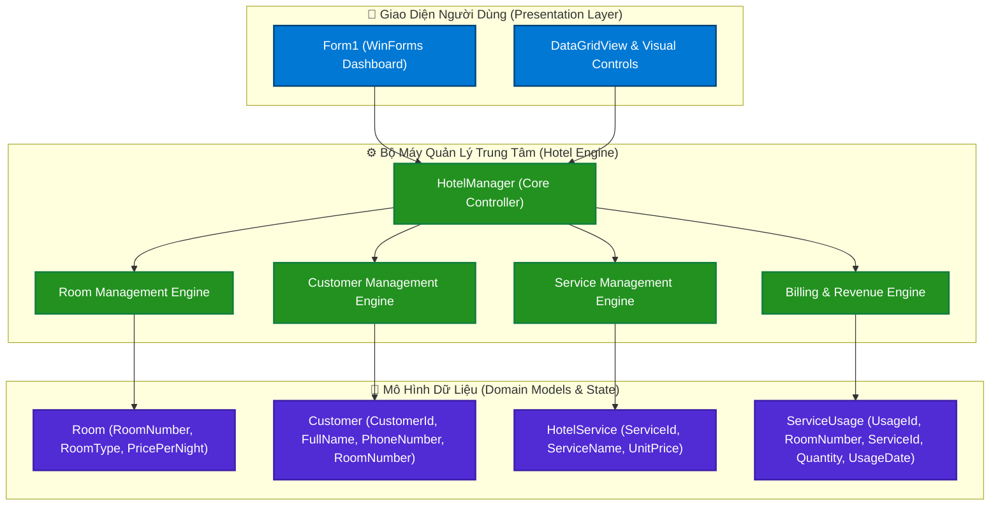
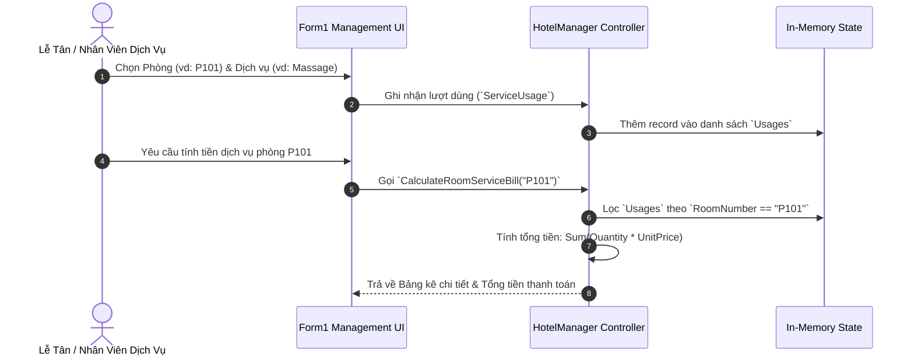

<div align="center">

# 🏨 GRAND HOTEL SUITE — HỆ THỐNG QUẢN LÝ KHÁCH SẠN & DỊCH VỤ DỰỠNG BỆNH/NGHỈ DƯỠNG

[](https://dotnet.microsoft.com/)
[](https://docs.microsoft.com/en-us/dotnet/csharp/)
[](https://learn.microsoft.com/en-us/dotnet/desktop/winforms/)
[]()
[](LICENSE)

<p align="center">
  <b>Hệ thống Quản lý Phòng Khách sạn, Dịch vụ Tiện ích & Thống kê Thu nhập theo Ngày</b><br>
  Tối ưu hóa quản lý phòng, theo dõi dịch vụ đa dạng (Giặt ủi, Massage, Tắm hơi, Nước uống...) và tự động tính tiền dịch vụ theo từng phòng.
</p>

---

[📖 Tính Năng](#-tính-năng-đột-phá) •
[🏗️ Kiến Trúc](#-kiến-trúc-hệ-thống) •
[⚙️ Thuật Toán & Xử Lý](#️-luồng-xử-lý--thuật-toán) •
[🚀 Cài Đặt](#-hướng-dẫn-cài-đặt) •
[🔮 Lộ Trình](#-lộ-trình-phát-triển)

</div>

<br>

---

## 💡 Tổng Quan Dự Án (Project Overview)

**QuanLyKhachSan (Grand Hotel Suite)** là phần mềm quản lý lưu trú & dịch vụ khách sạn chuyên nghiệp dành cho các khách sạn, resort và khu nghỉ dưỡng cao cấp. 

Khách sạn cung cấp hệ thống phòng nghỉ đa dạng cùng chuỗi dịch vụ tiện ích phong phú (giặt ủi, nước uống, massage thư giãn, tắm hơi thảo dược, ăn sáng tại phòng...). Mỗi dịch vụ được niêm yết mức giá riêng. Khách hàng lưu trú tại từng phòng có thể sử dụng linh hoạt nhiều dịch vụ, hệ thống tự động ghi nhận và **tính chi phí dịch vụ chính xác theo từng phòng**.

---

## 🚀 Tính Năng Đột Phá (Core Features)

| Icon | Nhóm Chức Năng | Chi Tiết Nghiệp Vụ |
| :---: | :--- | :--- |
| 🏨 | **Quản Lý Phòng (Room CRUD)** | Thêm phòng mới, cập nhật hạng phòng (Standard, VIP, Suite), giá phòng theo đêm, và xóa thông tin phòng. |
| 👤 | **Quản Lý Khách Hàng (Customer CRUD)** | Thêm, cập nhật thông tin cá nhân (SĐT, phòng ở), và quản lý hồ sơ lưu trú khách hàng. |
| 🛎️ | **Quản Lý Dịch Vụ (Service CRUD)** | Thêm dịch vụ tiện ích mới (Giặt ủi, Massage, Tắm hơi...), cập nhật bảng giá và xóa dịch vụ. |
| 🔤 | **Tra Cứu Giá Từ Điển (Alphabetical List)** | Tự động sắp xếp và hiển thị danh sách / bảng giá các dịch vụ theo thứ tự bảng chữ cái A-Z (`GetServicesAlphabetical`). |
| 🔍 | **Truy Xuất Sử Dụng Dịch Vụ** | Liệt kê chính xác danh sách các phòng và khách hàng đang/đã sử dụng một dịch vụ bất kỳ (`GetRoomsUsingService`, `GetCustomersUsingService`). |
| 🧾 | **Tính Tiền Dịch Vụ Theo Phòng** | Tự động tổng hợp danh sách dịch vụ đã dùng và tính tổng tiền dịch vụ cho từng phòng riêng biệt (`CalculateRoomServiceBill`). |
| 📊 | **Thống Kê Thu Nhập Trong Ngày** | Báo cáo chi tiết tổng thu nhập phát sinh trong ngày từ toàn bộ các dịch vụ tiện ích (`GetDailyServiceRevenue`). |

---

## 🏗️ Kiến Trúc Hệ Thống (Architecture)

Ứng dụng được thiết kế theo tiêu chuẩn **Modularity & Layered Architecture**, đảm bảo khả năng mở rộng và bảo trì linh hoạt.



---

## ⚙️ Luồng Xử Lý & Thuật Toán (Core Workflows & Logic)

### 1. Luồng Sử Dụng & Tính Tiền Dịch Vụ Theo Phòng



### 2. Thuật Toán Thống Kê Thu Nhập Ngày
* **Công thức tổng thu nhập dịch vụ trong ngày**:
  $$\text{DailyRevenue}(d) = \sum_{i \in \text{Usages}, \text{Date}(i) = d} \left( \text{Quantity}_i \times \text{UnitPrice}_i \right)$$

* **Sắp xếp bảng giá từ điển (Alphabetical Ordering)**:
  - Sử dụng LINQ `OrderBy(s => s.ServiceName, StringComparer.OrdinalIgnoreCase)` để đảm bảo bảng giá dịch vụ luôn được niêm yết theo thứ tự từ điển A-Z chuẩn Tiếng Việt.

---

## 💻 Phương Thức Nghiệp Vụ (API / Business Logic Methods)

| Phương Thức | Tham Số | Chức Năng |
| :--- | :--- | :--- |
| `AddRoom(Room room)` | `Room` | Thêm thông tin phòng nghỉ mới. |
| `UpdateRoom(Room room)` | `Room` | Cập nhật hạng phòng, trạng thái & giá phòng. |
| `DeleteRoom(string roomNumber)` | `roomNumber` | Xóa thông tin phòng nghỉ. |
| `AddCustomer(Customer customer)` | `Customer` | Đăng ký thông tin khách hàng lưu trú. |
| `AddService(HotelService service)` | `HotelService` | Thêm dịch vụ tiện ích mới (Giặt ủi, Massage...). |
| `GetServicesAlphabetical()` | *None* | Trả về danh sách dịch vụ sắp xếp A-Z theo tên. |
| `GetRoomsUsingService(string serviceId)` | `serviceId` | Tìm tất cả các phòng đã đăng ký sử dụng dịch vụ này. |
| `GetCustomersUsingService(string serviceId)`| `serviceId` | Tìm danh sách khách hàng đang dùng dịch vụ này. |
| `CalculateRoomServiceBill(string roomNumber)`| `roomNumber` | Tính tổng tiền chi phí dịch vụ của phòng cụ thể. |
| `GetDailyServiceRevenue(DateTime date)` | `date` | Thống kê tổng doanh thu từ dịch vụ trong ngày. |

---

## 📂 Cấu Trúc Thư Mục Project (Project Structure)

```text
QuanLyKhachSan/
├── 📄 QuanLyKhachSan.sln            # Visual Studio Solution File
├── 📁 QuanLyKhachSan/                # Core Project Directory
│   ├── 📄 Program.cs                # Entry point ứng dụng
│   ├── 📄 Form1.cs                  # Giao diện chính WinForms & Sự kiện UI
│   ├── 📄 Form1.Designer.cs         # Khởi tạo Controls giao diện
│   ├── 📄 Form1.resx                # Tài nguyên giao diện
│   ├── 📄 Room.cs                   # Model Phòng nghỉ (RoomNumber, Price, Status)
│   ├── 📄 Customer.cs               # Model Khách hàng (CustomerId, Name, Phone)
│   ├── 📄 HotelService.cs           # Model Dịch vụ (ServiceId, Name, Price)
│   ├── 📄 ServiceUsage.cs           # Model Nhật ký sử dụng dịch vụ theo phòng
│   ├── 📄 HotelManager.cs           # Core Controller xử lý toàn bộ nghiệp vụ
│   └── 📄 QuanLyKhachSan.csproj     # C# Project File (.NET 8.0 Windows)
├── 📄 LICENSE                       # Giấy phép mở MIT License
└── 📄 README.md                     # Tài liệu dự án chi tiết
```

---

## 💻 Hướng Dẫn Cài Đặt (Getting Started)

### Yêu Cầu Tiền Đề (Prerequisites)
* **Hệ điều hành**: Windows 10 / Windows 11 (64-bit).
* **SDK**: [.NET 8.0 SDK](https://dotnet.microsoft.com/download/dotnet/8.0) trở lên.
* **IDE Khuyên dùng**: Visual Studio 2022 (v17.8+) hoặc JetBrains Rider.

### Cài Đặt & Chạy Dự Án

1. **Clone repository về máy local**:
   ```bash
   git clone https://github.com/your-username/QuanLyKhachSan.git
   cd QuanLyKhachSan
   ```

2. **Restore Dependencies**:
   ```bash
   dotnet restore
   ```

3. **Biên Dịch Dự Án (Build)**:
   ```bash
   dotnet build --configuration Release
   ```

4. **Chạy Ứng Dụng (Run)**:
   ```bash
   dotnet run --project QuanLyKhachSan/QuanLyKhachSan.csproj
   ```

---

## 🔮 Lộ Trình Phát Triển (Roadmap)

- [x] **Giai đoạn 1**: Hoàn thiện bộ mô hình dữ liệu (Room, Customer, Service, Usage) & Controller xử lý 7 yêu cầu cốt lõi.
- [ ] **Giai đoạn 2**: Tích hợp cơ sở dữ liệu **SQL Server** kết nối qua **Entity Framework Core 8**.
- [ ] **Giai đoạn 3**: Xuất hóa đơn dịch vụ định dạng **PDF / Excel** và in hóa đơn thanh toán khi trả phòng.
- [ ] **Giai đoạn 4**: Tích hợp mã **VietQR** thanh toán tự động theo tổng bill dịch vụ từng phòng.

---

## 📄 Giấy Phép (License)

Phần mềm được phát hành dưới giấy phép [MIT License](LICENSE).

---

<div align="center">

⭐ **If you find this project useful, please consider giving it a star!** ⭐

Made with ❤️ & C# .NET 8.0 by **PTUDD Team**

</div>
