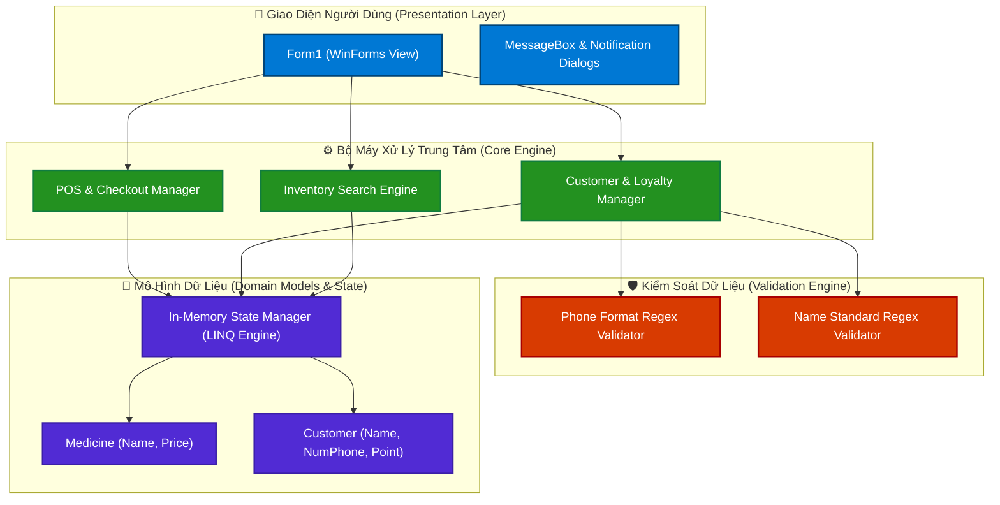
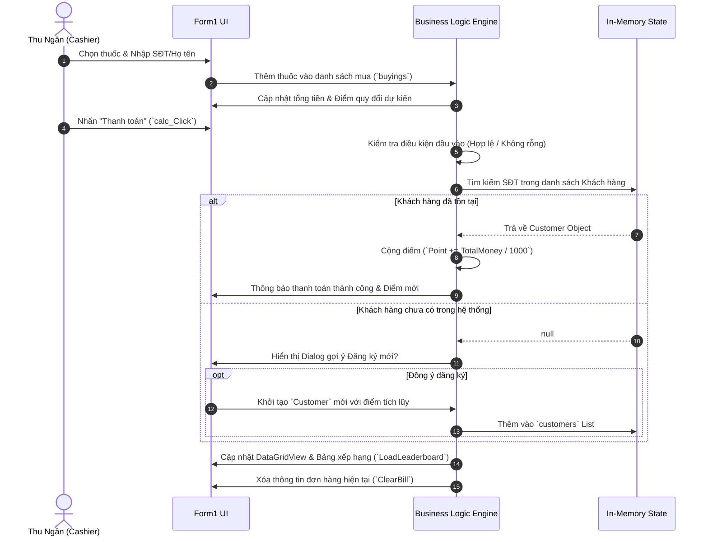

<div align="center">

# 🏥 PHARMACARE PRO — HỆ THỐNG QUẢN LÝ NHÀ THUỐC & KHÁCH HÀNG THÂN THIẾT

[](https://dotnet.microsoft.com/)
[](https://docs.microsoft.com/en-us/dotnet/csharp/)
[](https://learn.microsoft.com/en-us/dotnet/desktop/winforms/)
[]()
[](LICENSE)

<p align="center">
  <b>Hệ thống Quản lý Bán lẻ Nhà thuốc & Chương trình Tích điểm Gamified thế hệ mới</b><br>
  Tối ưu hóa quy trình bán hàng (POS), tự động hóa tìm kiếm đơn thuốc & chăm sóc khách hàng thân thiết.
</p>

---

[📖 Tính Năng](#-tính-năng-đột-phá) •
[🏗️ Kiến Trúc](#-kiến-trúc-hệ-thống) •
[⚙️ Luồng Xử Lý](#️-luồng-xử-lý--thuật-toán) •
[🚀 Cài Đặt](#-hướng-dẫn-cài-đặt) •
[🔮 Lộ Trình](#-lộ-trình-phát-triển)

</div>

<br>

---

## 💡 Tổng Quan Dự Án (Project Overview)

**QuanLyNhaThuoc (PharmaCare Pro)** là giải pháp phần mềm quản lý điểm bán hàng (POS) chuyên biệt cho các cơ sở kinh doanh dược phẩm, nhà thuốc tư nhân và chuỗi bán lẻ thuốc tây. Được xây dựng trên nền tảng **.NET 8.0 Desktop**, ứng dụng kết hợp giữa **tốc độ xử lý siêu nhanh** và **trải nghiệm người dùng thân thiện**, giải quyết triệt để các bài toán:

* ⚡ **Thanh toán nhanh chóng**: Giảm thiểu thời gian chờ đợi tại quầy thuốc với cơ chế tự động tính tiền và tự động đề xuất thuốc thông minh.
* 🎁 **Tích điểm & Giữ chân khách hàng**: Tích hợp chương trình Loyalty tự động chuyển đổi giá trị hóa đơn sang điểm thưởng (`1.000 VNĐ = 1 Điểm`).
* 🏆 **Bảng xếp hạng VIP (Gamification)**: Thúc đẩy mua hàng lặp lại thông qua hệ thống xếp hạng thành viên thân thiết thời gian thực.
* 🛡️ **Chuẩn hóa dữ liệu đầu vào**: Xác thực dữ liệu nghiêm ngặt (Số điện thoại chuẩn Việt Nam, Họ tên hợp lệ) bằng biểu thức chính quy (Regex Engine).

---

## 🚀 Tính Năng Đột Phá (Core Features)

| Biểu Tượng | Tính Năng | Mô Tả Chi Tiết |
| :---: | :--- | :--- |
| 💊 | **Tra Cứu Thuốc Real-Time** | Tìm kiếm thuốc theo dạng Auto-Suggest (Gợi ý ngay khi gõ), hỗ trợ danh mục dược phẩm phong phú (Kháng sinh, Thần kinh, Vitamin, Hạ sốt...). |
| 🛒 | **Giỏ Hàng & Thanh Toán Siêu Tốc** | Thêm thuốc vào giỏ hàng linh hoạt, tự động tổng hợp tổng tiền hóa đơn (`N0 Format`) và quy đổi điểm tích lũy ngay tức thì. |
| 🔍 | **Truy Xuất Khách Hàng Thông Minh** | Tìm kiếm khách hàng đa tiêu chí theo SĐT hoặc Họ tên với độ chính xác cao. |
| 📝 | **Đăng Ký Thành Viên Tự Động** | Khi thanh toán cho khách hàng mới, hệ thống tự động phát hiện và gợi ý tạo tài khoản thành viên chỉ với 1 cú click. |
| 🔒 | **Xác Thực Dữ Liệu An Toàn** | Kiểm soát cú pháp SĐT chuẩn Việt Nam (`^0\d{9}$`), lọc ký tự đặc biệt trong Họ tên (`^[\p{L}\s]+$`), chống trùng lặp dữ liệu. |
| 🏆 | **Bảng Xếp Hạng Khách Hàng (VIP Leaderboard)** | Tự động sắp xếp và hiển thị TOP khách hàng thân thiết theo số điểm tích lũy (`OrderByDescending`). |

---

## 🏗️ Kiến Trúc Hệ Thống (Architecture)

Ứng dụng được thiết kế theo hướng **Modularity & Clean Logic Pattern**, tách biệt rõ ràng giữa mô hình dữ liệu (Data Models), giao diện người dùng (UI Event Handlers), và bộ máy xử lý (In-Memory Processing Engine).



---

## ⚙️ Luồng Xử Lý & Thuật Toán (Core Logic & Workflows)

### 1. Luồng Thanh Toán & Tích Điểm (POS & Loyalty Sequence)



### 2. Thuật Toán Tích Điểm & Định Dạng Tiền Tệ
* **Công thức tích điểm**: 
  $$\text{Points} = \left\lfloor \frac{\text{Tổng tiền hóa đơn (VNĐ)}}{1000} \right\rfloor$$
* **Biểu thức chính quy (Regex Validation)**:
  - **Số điện thoại**: `^0\d{9}$` (Bắt buộc bắt đầu bằng 0, độ dài chính xác 10 chữ số).
  - **Họ tên**: `^[\p{L}\s]+$` (Chấp nhận tất cả ký tự tiếng Việt có dấu và khoảng trắng, chặn tuyệt đối ký tự đặc biệt & số).

---

## 📂 Cấu Trúc Thư Mục Project (Project Structure)

```text
QuanLyNhaThuoc/
├── 📄 QuanLyNhaThuoc.sln            # Visual Studio Solution File
├── 📁 QuanLyNhaThuoc/                # Core Project Source Directory
│   ├── 📄 Program.cs                # Main Application Entry Point
│   ├── 📄 Form1.cs                  # Main Form Business Logic & Event Handlers
│   ├── 📄 Form1.Designer.cs         # Auto-generated UI Layout Components
│   ├── 📄 Form1.resx                # GUI Form Resource File
│   ├── 📄 Customer.cs               # Customer Domain Model (Name, Phone, Point)
│   ├── 📄 Medicine.cs               # Medicine Domain Model (Name, Price)
│   └── 📄 QuanLyNhaThuoc.csproj     # .NET 8.0 C# Project Configuration
└── 📄 README.md                     # Comprehensive Technical Documentation
```

---

## 💻 Hướng Dẫn Cài Đặt (Getting Started)

### Yêu Cầu Tiền Đề (Prerequisites)
* **Hệ điều hành**: Windows 10 / Windows 11 (64-bit).
* **SDK**: [.NET 8.0 SDK](https://dotnet.microsoft.com/download/dotnet/8.0) trở lên.
* **IDE Khuyên dùng**: Visual Studio 2022 (v17.8+) hoặc JetBrains Rider 2023.3+ (với Workload **.NET Desktop Development**).

### Các Bước Cài Đặt & Chạy Ứng Dụng

1. **Clone repository về máy local**:
   ```bash
   git clone https://github.com/your-username/QuanLyNhaThuoc.git
   cd QuanLyNhaThuoc
   ```

2. **Khôi phục các gói phụ thuộc (Restore dependencies)**:
   ```bash
   dotnet restore
   ```

3. **Biên dịch & Phát triển (Build Project)**:
   ```bash
   dotnet build --configuration Release
   ```

4. **Khởi chạy ứng dụng (Run App)**:
   ```bash
   dotnet run --project QuanLyNhaThuoc/QuanLyNhaThuoc.csproj
   ```

---

## 🔮 Lộ Trình Phát Triển (Roadmap)

- [x] **Giai đoạn 1**: Hoàn thiện UI/UX chuẩn POS, quản lý khách hàng & cơ chế tích điểm căn bản.
- [ ] **Giai đoạn 2**: Tích hợp cơ sở dữ liệu quan hệ **SQL Server / PostgreSQL** với **Entity Framework Core 8**.
- [ ] **Giai đoạn 3**: Tích hợp in hóa đơn nhiệt **POS Thermal Printer (80mm)** qua cổng USB/LAN.
- [ ] **Giai đoạn 4**: Tích hợp cổng thanh toán mã **VietQR (Napas247)** tự động tạo mã QR chuyển khoản theo số tiền hóa đơn.
- [ ] **Giai đoạn 5**: Quản lý hạn sử dụng (Expiry Date) & cảnh báo lô thuốc sắp hết hạn (FEFO/FIFO).

---

## 📄 Giấy Phép & Đóng Góp (License & Contributing)

Phần mềm được phát hành dưới giấy phép [MIT License](LICENSE). Mọi đóng góp từ cộng đồng (Pull Requests, Issue Reports, Feature Proposals) đều được hoan nghênh nhiệt liệt!

---

<div align="center">

⭐ **If you find this project useful, please consider giving it a star!** ⭐

Made with ❤️ & C# .NET 8.0 by **PTUDD Team**

</div>
